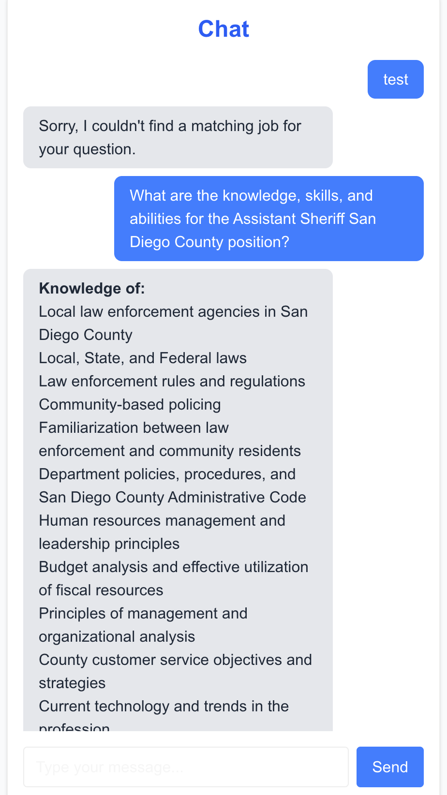

# Holly Engineering Take-Home Assignment

**result:**

## Steps to run:

- add Gemini API key inside `.env.local` file.
`GEMINI_API_KEY=API_KEY_HERE`
- run `npm run dev`

## Overview

This take-home assignment is designed to evaluate your technical skills across several areas important to our engineering team. Please spend no more than 2-3 hours on this task. It's completely fine if you don't finish everything - we're more interested in understanding your approach and thought process.

## Goals

This assignment evaluates your skills in:

1. Data processing
2. Next.js development
3. LLM integration
4. TypeScript

## The Challenge

You'll build a simple chat interface that allows users to query job and salary information stored in JSON files. Think of it as a basic HR assistant that can answer questions about job descriptions and compensation. The interface doesn't have to be anything fancy.

## Requirements

### 1. Chat Interface (~30 mins)

- Create a dedicated chat page (`/chat`) with a message interface
- Style the interface so AI messages appear on the right and human messages on the left
- The UI doesn't need to be elaborate - focus on functionality over aesthetics

### 2. LLM Integration (~1 hr 30 mins)

- Integrate with an LLM of your choice
- The LLM should be able to answer questions about the data in your matched dataset
- **Important**: Your implementation should parse the user's query to identify which specific job they're asking about, and only pass the relevant job information to the LLM - do not pass the entire dataset to the LLM with each request
- Example queries and responses:
  - "What are the knowledge, skills, and abilities for the Assistant Sheriff San Diego County position?"
    - "The Assistant Sheriff in San Diego County should have knowledge of: local law enforcement agencies in San Diego County, local/state/federal laws, law enforcement rules and regulations, community-based policing..."
  - "What is the salary for the Assistant Chief Probation Officer in San Bernardino?"
    - "The Assistant Chief Probation Officer in San Bernardino has a salary range from $70.38 to $101.00 per hour (salary grades 1 and 2)."

## Technical Requirements

- Use Next.js for the application framework
- Implement proper TypeScript typing throughout the application
- Implement server actions where appropriate
- Do not use a dedicated backend server or database - all data should be stored and retrieved from the JSON files
  - By dedicated backend server, we mean not setting up separate Node.js, Flask, or other backend services. You are permitted to use Next.js built-in server capabilities.
  - By dedicated database, we mean not setting up a MongoDB, PostgreSQL, MySQL or similar database system. All data should be stored and retrieved from JSON files.
- Clean, maintainable code with clear organization

## Submission

Please submit:

1. The complete codebase in a public GitHub repository
   - https://github.com/danielhamg/holly-eng-take-home-danielhamg
2. Instructions for running the application locally
   - In "Steps to run:" section
3. A brief writeup explaining your approach, technologies used, and any challenges you faced
   - My main approach to this was to use VSCode's copilot due to my limited experience in next.js, incrementally creating functionality needed.
   - First I asked it to make the chat feature and used sample responses to initialize an interface.
   - Then I researched which llm to use and integrated it. For the LLM to call, I used a free gemini version. Interesting, when I ask copilot to edit the code, it would often override the model I am using from gemini with a pro version I do not have. But writing a comment asking copilot to not change the line seems to work fine.
   - Then I put in instructions to pre-process data before sending it to Gemini.
   - This is my first time since working at my previous job, that I actually am using an LLM to do a coding project. It showed me just how powerful AI coding tools are.

## Notes

- You're free to use any NLP approach (vector embeddings, regex, etc.) to enable querying the data
- Focus on demonstrating your understanding of Next.js patterns, TypeScript, and clean code organization
- Don't spend too much time on UI aesthetics - functionality is the priority
- Use JSON files as your database - no need for external data storage
- We'll be evaluating how efficiently you process and filter data before sending to the LLM
